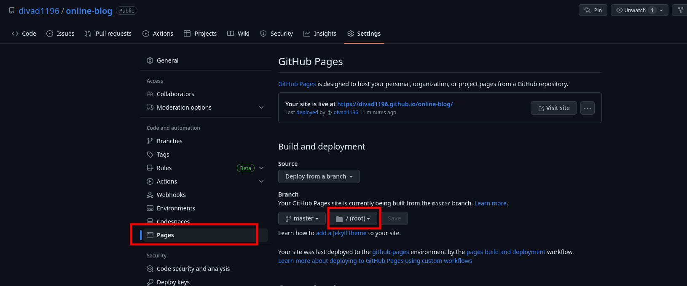

# My Website
* Using [H.U.G.O](https://gohugo.io/) framework
* Theme: **fork** of [PaperMod](https://themes.gohugo.io/themes/hugo-papermod/)
  This was added using subtree to fix the version and allow easy changes
  
  ```bash
  git subtree add --squash -P themes/PaperMod git@github.com:divad1196/hugo-PaperMod.git master
  # git subtree pull -P themes/PaperMod git@github.com:divad1196/hugo-PaperMod.git master
  ```


## Deploy

We will use [github's Pages option](https://gohugo.io/hosting-and-deployment/hosting-on-github/) for the deployement.

* The repository needs to be public otherwise you need a paid account
* You can only use the repository's root or `docs/` folder for your pages.



I personally use the root folder and I will copy my website manually into another repository.


1. Build the static site

   ```bash
   hugo --minify -b https://divad1196.github.io/online-blog/
   ```

   nb: This will change the base url for the deployment on github

2. Copy the **CONTENT** of the generated `public/` folder at the root of the repository https://github.com/divad1196/online-blog
   (replace the hold content).


## Custom configuration

* `overview: true` on a page: display it on the home page

* Support for [mermaid](https://mermaid-js.github.io/mermaid/#/) diagram ([official hugo tutorial](https://gohugo.io/content-management/diagrams/))

* Support for charts using `Chart.js` .
  
* 
  


### chart (generic)

Usage

```bash

```

Nb: The data will be taken from the **Data folder**, in this case `data=charts.example` means there is a file under `data/charts/example.yml`

* Id (Optional): The id of the canvas, must be unique to use Chart.js
  If not provided, we will use the md5 hash of the data used (jsonified)

* data (Required): The data to pass to the chart constructor

  ```js
  new Chart(ctx, $chartData }});
  ```

  For example, the file `data/charts/example.yml` could contain the following data

  ```yaml
  type: "bar"
  data:
    labels: ['10-June-19', '11-June-19', '12-June-19', '13-June-19', '14-June-19', '15-June-19']
    datasets:
      - label: '# of Commits'
        data: [0, 24, 94, 21, 25, 34]
        backgroundColor: [
            'rgba(255, 99, 132, 0.2)',
            'rgba(54, 162, 235, 0.2)',
            'rgba(255, 206, 86, 0.2)',
            'rgba(75, 192, 192, 0.2)',
            'rgba(153, 102, 255, 0.2)',
            'rgba(255, 159, 64, 0.2)'
        ]
        borderColor: [
            'rgba(255, 99, 132, 1)',
            'rgba(54, 162, 235, 1)',
            'rgba(255, 206, 86, 1)',
            'rgba(75, 192, 192, 1)',
            'rgba(153, 102, 255, 1)',
            'rgba(255, 159, 64, 1)'
        ]
        borderWidth: 1
  options: {
      scales: {
          yAxes: [{
              ticks: {
                  beginAtZero: true
              }
          }]
      }
  }
  ```


Improvement possible:

* Simplify some charts by pre-selecting some values
* For bar charts: Allow opening link by clicking a given bar?
  https://stackoverflow.com/questions/37122484/chart-js-bar-chart-click-events


### barChart

This is a simplier way to use a bar chart by only providing labels and data

#### Usage

In markdown

```go

```

in `data/charts/skills.yml`

```yaml
labels: ['C/C++', 'Python', 'Javascript', 'Bash', 'SQL', 'Java', 'Rust']
data: [80, 90, 70, 60, 70, 70, 20]
```

The colors are the one defined in `data/charts/colors.yml` and can be override if wanted


## Issues encountered

#### Posts not showing on the first page
* The page can not be in "profile mode"
* The files must be in the folder `content/posts/`
* There can not be any folder with file in `content/` that is alphabetically before `content/posts/`