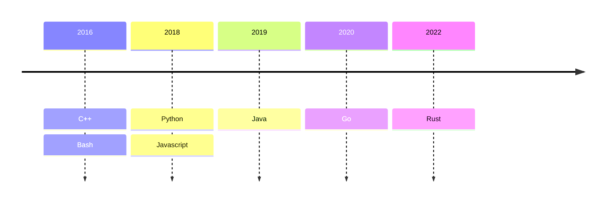

# Timeline

# Mastery

<!--  -->


Some more details below
### 1. Python &#x1F5F2;
* Since 2018
* Used daily
* Frameworks & libraries:
  * **Web**: Fastapi, Flask, Django, Odoo
  * **ORM**: SQLAlchemy, PonyOrm, Odoo
  * **ML/AI**: [CrewAI](https://www.crewai.com/) and [Ollama](https://ollama.com/) (Existing LLM consumption), [PyTorch](https://pytorch.org/) (Model fine-tuning)
  * **Data**: Pandas, numpy
  * **Interface**: Tkinter, pygame
  * **Scripting/Scrapping**: lxml, json, requests/httpx, [Pillow](https://pillow.readthedocs.io/en/stable/) (image processing), [BeautifulSoup](https://beautiful-soup-4.readthedocs.io/en/latest/), ... 
  * ...

### 2. C/C++
* Since 2016
* Used regularly in the past and occasionally on small personal projects
* Implementation of custom-made Data structures and algorithms at need for performance.
  Now, I usually prefer to use Rust when possible
* Frameworks & libraries:
  * **Interface/Graphism**: [SFML](https://www.sfml-dev.org/), [QT](https://www.qt.io/product/framework) (Did a harmonic movement simulator)
  * **Web**: CrowCpp, Pistache.io
  * **Math**: Eigen
  * **Misc**: Boost, [nlohmann/json](https://github.com/nlohmann/json), ...

### 3. Rust &#x2665;
* Since 2022
* My current favorite language.  
  Its syntax, its powerful macros, its project management and its good design and good usage of functional programming concepts, security concerns ... are unmatched
* Frameworks & libraries:
  * **Web**: Rocket, Axum & Actix
  * **Concurrency**: Rayon, Tokyo
  * **Serialization**: Serde (what else ?)
  * **ORM**: Diesel
  * **Permissions**: Casbin
  * **CLI**: clap  

  and the list keeps growing!

### 4. Javascript (& Web)
* Started to learn in 2018
* Mostly frontends: Vuejs, ReactJS, AlpineJs, HTMX, Jquery, [OWL](https://github.com/odoo/owl), CSS/SCSS, bootstrap.  
  Nb: I don't have a graphical skill, meaning I am usually not the one creating the design.
* Also did some projects on: algorithms implementations, rendering, scrapping (puppeteer), ML (Tensorflow for hand gesture recognition) and WebRTC/streaming

### 5. Java
* Since 2019
* Mostly did:
  * Data structure and algorithms implementations
  * Web (Springboot)
  * Interface (Swing)

### 6. Go
* Since 2020
* Mostly did:
  * Microservices (e.g. proxy to transform requests)
  * Terraform provider

### 7. Bash
* Since 2016
* Mostly did:
  * I extensively use the terminal. 
    Using bash allow me to test and reproduce my workflows.
  * One-shot scripts
  * CI scripts (often in combination with [Makefile](https://www.gnu.org/software/make/manual/make.html) and [Phony targets](https://www.gnu.org/software/make/manual/html_node/Phony-Targets.html))

### 8. SQL
I am comfortable with the old standard and the Postgres' flavor, but since I saw [modern SQL](https://modern-sql.com/), I think I have some more to learn before being statisfied with my level.

### 9. Kotlin
Learned the basics of how to create a native android app.
